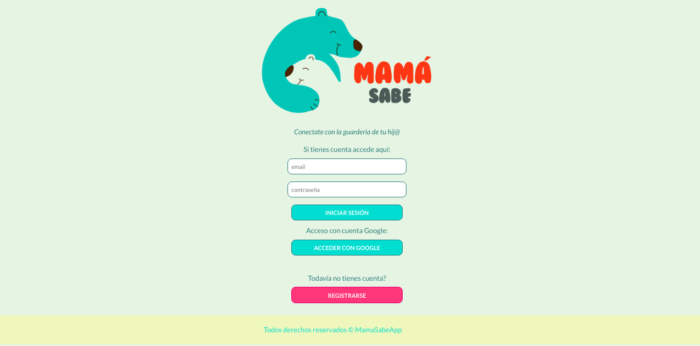
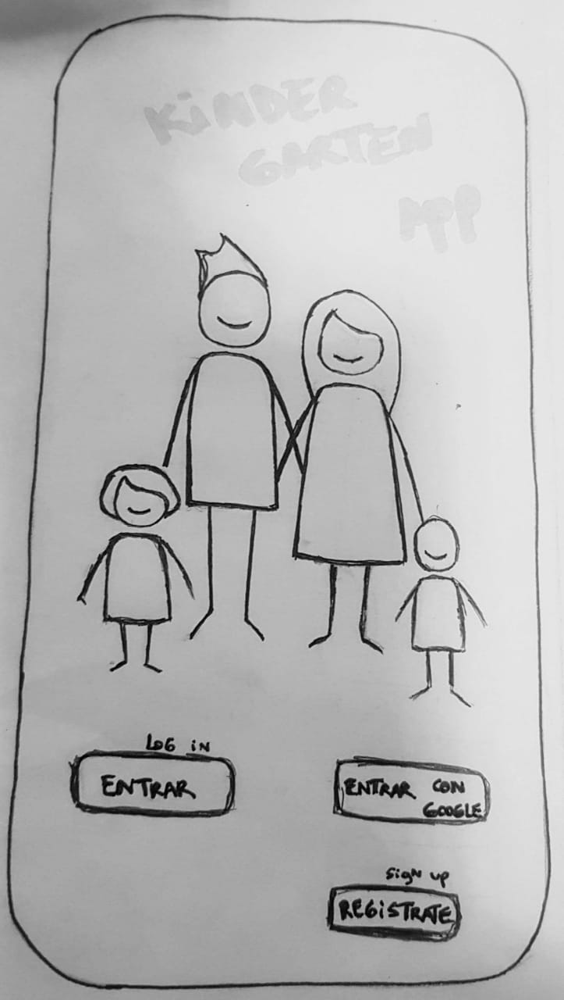
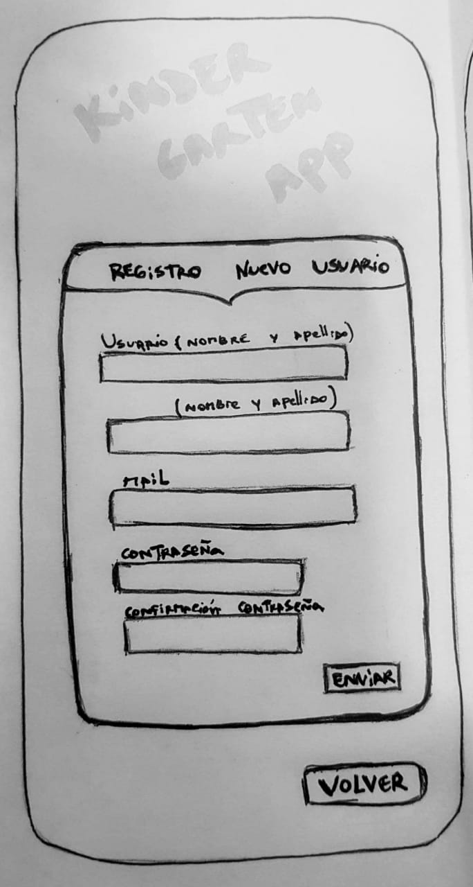
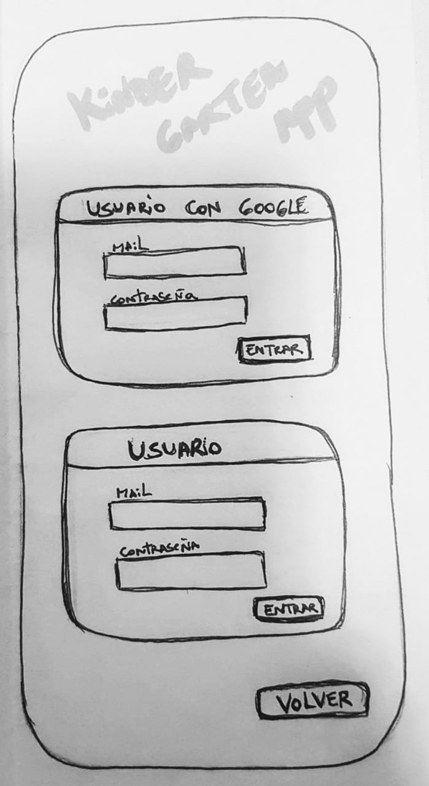
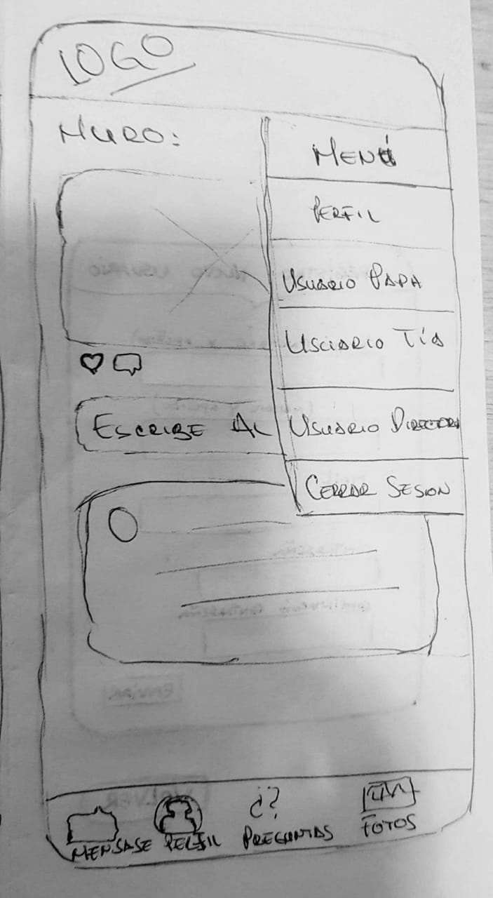
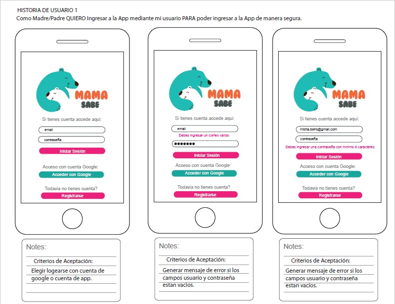
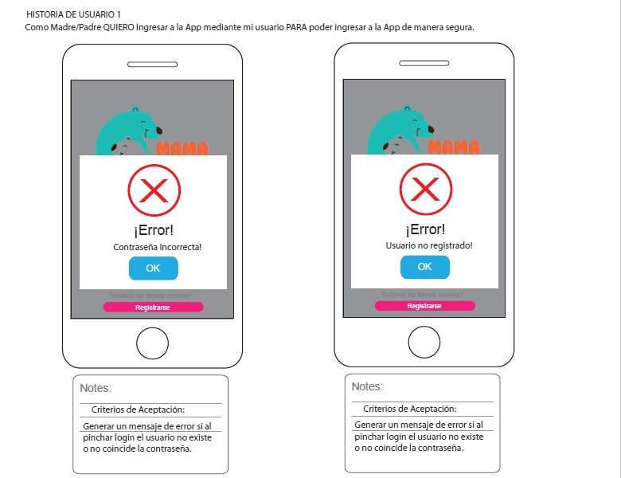
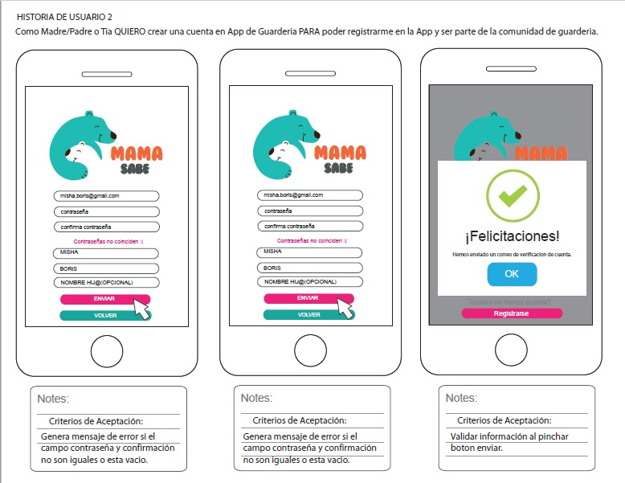
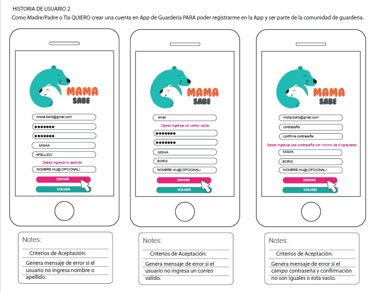
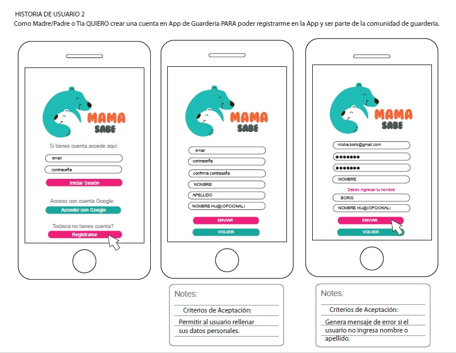

# APLICACIÓN MAMÁ SABE

Mamá Sabe App, es una Red Social para padres (mamis y papis) que tienen hij@s en guarderias y quieren estar todo el timepo informados sobre lo que hacen en estos lugares donde sus hij@s pasan parte de su tiempo, además de estar conectados con las tías que los cuidan y entre ell@s, para intercambiar tips, consejos y cualquier material relevante (informaciones, articulos, fotos, videos y más), pudiendo acceder a ella en cualquier momento desde cualquier dispositivo.

**[VER PÁGINA](https://mariia1304.github.io/SCL009-Social-Network/index.html)**

# DEFINICIÓN DEL PRODUCTO

Nuestra idea nace de observar la cantidad de grupos (ej.:facebook, whatsapp) de padres/madres que quieren comunicarse con las tias que cuidan a sus hij@s en guarderias y su necesidad de estar informados al respecto. Se realizó una encuesta a algunos padres/madres que tenian hij@s en guarderias, preguntando: Como se comunican y/o obtienen informaciones de las tias y otros padres/madres?, Si se unirian a una red social donde puedan compartir y comunicarse con las tias y otros padres/madres?, Cuan importante seria estar informados de lo que hacen tus hij@s en sus guarderias y poder acceder a esa información en todo momento?, y los resultados de esta arrojaron que mas de un 70% le da valor al estar informados y comunicados en lo que respecta a las guarderias de sus hij@s. Basadas en esto quisimos brindar una herramienta esclusiva para tal fin: Mamá Sabe App!

# PROCESO DE DISEÑO Y PLANIFICACIÓN DEL PROYECTO

**Prototipamos nuestra idea con los siguientes sckeths:**
****
****
****
****
****

A raiz de estas aristas, pudimos definir cada una de las historias de usuario que nos llevan a la construcción de esta App, la cual planificamos de la siguiente forma:
**[LINK: Planificación Red Social](https://trello.com/b/aZR2LZuS/red-social)**.

# HISTORIAS DE USUARIO Y DISEÑO DE INTERFAZ DE USUARIO

### 1) Como Madre/Padre QUIERO Ingresar a la App mediante mi usuario PARA poder ingresar a la App de manera segura.

## Criterios de Aceptación:
.- Elegir logearse con cuenta de google o cuenta de app
.- Generar mensaje de error si los campos usuario y contraseña estan vacios
.- Generar un mensaje de error si al pinchar login el usuario no existe o no coincide la contraseña.

****
**** 

### 2) Como Madre/Padre o Tia QUIERO crear una cuenta en App de Guarderia PARA poder registrarme en la App y ser parte de la comunidad de guarderia.

## Criterios de Aceptación:
.- Permitir al usuario rellenar sus datos personales
.- Genera mensaje de error si el usuario no ingresa nombre o apellido.
.- Genera mensaje de error si el usuario no ingresa un correo valido.
.- Genera mensaje de error si el campo contraseña y confirmación no son iguales o esta vacio.
.- Validar información al pinchar boton enviar.
.- Cuando el usuario crea la cuenta, debe recibir un correo de verificación.
.- Despues que el usuario verifique correo se le informará la creación exitosa de su cuenta. 

****
****
****

### 3) Como Madre/Padre QUIERO ver el muro General de la App PARA informarme de las novedades (fotos e informaciones) 
## Criterios de Aceptación:
.- Permitir al usuario ver las publicaciones del muro
.- Permitir al usuario Crear(CRUD) una publicación mediante un cuadro de texto.
.- Permitir al usuario leer (CRUD) publicación.
.- Permitir al usuario editar(CRUD) publicación.
.- Permitir al usuario eliminar(CRUD) publicación.
.- Permitir al usuario dar likes a una publicación.
.- Permitir al usuario conocer la cantidad de likes de una publicación.

**** (X imagenes)

## DEFINICIÓN DE TERMINADO QUE DEBEN CUMPLIR CADA UNA DE LAS HISTORIAS DE USUARIO:
- Debe ser una SPA.
- Debe ser responsive.
- Debes haber recibido code review de al menos una compañera de otro equipo.
- Haces test unitarios y, además, has testeado tu producto manualmente.
- Hiciste pruebas de usabilidad e incorporaste el feedback del usuario.
- Desplegaste tu aplicación y has etiquetado tu versión (git tag).

# TEST DE USABILIDAD

En la medida que avanzamos en la construcción de esta app se realizaron algunos test de usabilidad que sirvieron para corregir errores, pueden acceder a algunos de los videos acá:

[Test HU1](src/assets/img/)
[Test HU2](src/assets/img/) 
[Test HU3](src/assets/img/)

# CHECKLIST

# Creando una Red Social

## Índice

* [Preámbulo](#preámbulo)
* [Resumen del proyecto](#resumen-del-proyecto)
* [Objetivos de aprendizaje](#objetivos-de-aprendizaje)
* [Consideraciones generales](#consideraciones-generales)
* [Parte obligatoria](#parte-obligatoria)
* [Hacker Edition](#hacker-edition)
* [Consideraciones técnicas](#consideraciones-técnicas-front-end)
* [Contenido de referencia](#pistas-/-tips-/-lecturas-complementarias)

***

## Preámbulo

Instagram, Snapchat, Twitter, Facebook, Twitch, Linkedin, etc. Las redes
sociales han invadido nuestras vidas. Las amamos u odiamos, y muchos no podemos
vivir sin ellas.

Hay redes sociales de todo tipo y para todo tipo de intereses. Por ejemplo,
en una ronda de financiamiento con inversionistas, se presentó una red social
para químicos en la que los usuarios podían publicar artículos sobre sus
investigaciones, comentar en los artículos de sus colegas, y filtrar artículos
de acuerdo a determinadas etiquetas o su popularidad, lo más reciente, o lo
más comentado.

## Resumen del proyecto

En este proyecto construirás una Red Social sobre lo que decidan tú y tu equipo.
Podría ser, por ejemplo, sobre alimentación saludable, feminismo, educación,
salud, energías renovables, amantes de las [empanadas](https://es.wikipedia.org/wiki/Empanada) o de
los [tacos de canasta](https://es.wikipedia.org/wiki/Taco), etc.

Tu Red Social tendrá que permitir a cualquier usuario crear una cuenta de
acceso y loguearse con ella; crear, editar, borrar y _"likear"_ publicacciones.

## Objetivos de Aprendizaje

El objetivo principal de aprendizaje de este proyecto es construir una
[Single-page Application (SPA)](https://es.wikipedia.org/wiki/Single-page_application)
[_responsive_](https://github.com/Laboratoria/curricula-js/tree/master/topics/css/02-responsive)
 (con más de una vista / página) en la que podamos **leer y escribir datos.**

## Consideraciones generales

- Este proyecto se debe "resolver" en tríos.

- La lógica del proyecto debe estar implementada completamente en JavaScript (ES6+),
HTML y CSS :smiley:. Para este proyecto no está permitido utilizar
frameworks o librerías de CSS y JS.

- La división del trabajo debe permitir que todo el equipo
practique el aprendizaje de todo lo esperado **cada sprint**. _No se dividan el
trabajo como en una fábrica._

- Trabajen en una sola historia por vez, no pueden avanzar a la siguiente sin
haber completado la anterior.

Para comenzar tendrás que hacer un _fork_ y _clonar_ este
repositorio.

## Parte obligatoria

### General

Este proyecto no incluye un _boilerplate_, así es que tendrás que definir la
estructura de carpetas y escribir tus propias Pruebas Unitarias (tests). Para
hacerlo, puedes guiarte de los proyectos anteriores.

### Definición del producto

En el `README.md` cuéntanos brevemente cómo descubriste las necesidades de los
usuarios y cómo llegaste a la definición final de tu producto. Comparte fotos de
entrevistas (si las tienes), cuestionarios y tus sketches/(bocetos).

Es importante que detalles:

* Quiénes son los principales usuarios de producto.
* Qué problema resuelve el producto / para qué le servirá a estos usuarios.

### Historias de usuario

Una vez que entiendas las necesidades de tus usuarixs, escribe las Historias de
Usuario que representen todo lo que necesitan hacer/ver en la Red Social.

Cada una de tus Historias de Usuario debe tener:
- **Criterios de Aceptación:** todo lo que debe ocurrir para satisfacer las
  necesidades del usuario.

- **Definición de terminado:** todos los aspectos técnicos que deben cumplirse
para que, como equipo, sepan que esa historia está terminada y lista
para publicarse. **Todas** tus Historias de Usuario (salvo excepciones), deben
incluir estos aspectos en su Definición de Terminado (más todas las que
  necesiten agregar):

  * Debe ser una SPA.
  * Debe ser _responsive_.
  * Debes haber recibido _code review_ de al menos una compañera de otro equipo.
  * Haces _test_ unitarios y, además, has testeado tu producto manualmente.
  * Hiciste _pruebas_ de usabilidad e incorporaste el _feedback_ del usuario.
  * Desplegaste tu aplicación y has etiquetado tu versión (git tag).

### Diseño de la Interfaz de Usuario (prototipo de baja fidelidad)

Debes definir cuál será el flujo que seguirá el usuario dentro de tu producto y
con eso deberás diseñar la Interfaz de Usuario (UI por sus siglas en inglés) de
esta red social que siga este flujo.
Este diseño debe representar la solución que se implementará finalmente en
código.

### Responsive

Debe verse bien en dispositivos de pantallas grandes
(computadoras/es, laptops, etc.) y pequeñas (tablets, celulares, etc.). Te
sugerimos seguir la técnica de `mobile first` (más detalles sobre esta técnica
al final).

### Pruebas unitarias (unit tests)

Los tests unitarios deben cubrir un mínimo del 70% de _statements_, _functions_,
_lines_, y _branches_.

### Implementación de la Interfaz de Usuario (UI y comportamiento de Interfaz de Usuario)

Estas son consideraciones para que escribas las Definiciones de Terminado de
tus H.U.:

#### Creación de cuenta de usuario e inicio de sesión

* Login con Firebase:
  - Para el login y las publicaciones en el muro puedes utilizar [Firebase](https://firebase.google.com/products/database/)
  - Creación de cuenta de acceso y autenticación con cuenta de correo y
    contraseña, y con cuenta de Google.
* Validaciones:
  - La aplicación solo permitirá el acceso a usuarios con cuentas válidas.
  - No pueden haber usuarios repetidos.
  - La cuenta de usuario debe ser un correo electrónico válido.
  - Lo que se escriba en el campo (_input_) de contraseña debe ser secreto.
* Comportamiento:
  - Al enviarse un formulario de registro o inicio de sesión, debe validarse.
  - En caso haya errores, el sistema debe mostrar mensajes de error para
    ayudar al usuario a corregirlos.
  - Al recargar la aplicación, se debe verificar si el usuario está
    logueado antes de mostrarle el contenido.

#### Muro/timeline de la red social

* Validaciones:
  - Al apretar el botón de publicar, debe validar que exista contenido en
  el _input_.
* Comportamiento:
  - Poder publicar un _post_.
  - Poder dar y quitar _like_ a una publicación.
  - Llevar un conteo de los _likes_.
  - Poder eliminar un post específico.
  - Pedir confirmación antes de eliminar un _post_.
  - Al dar _click_ para editar un _post_, debe cambiar el texto por un _input_
    que permita editar el texto y luego guardar los cambios.
  - Al guardar los cambios debe cambiar de vuelta a un texto normal pero con la
    información editada.
  - Al recargar la página debo de poder ver los textos editados.

### Hacker edition

* Permite crear posts con imágenes.
* Permite buscar usuarios, agregar y eliminar "amigos".
* Permite definir la privacidad de los _posts_ (público o solamente para amigos).
* Permite ver su muro de cualquier usuario "no-amigo" (solamente los
  posts _públicos_).
* Permite comentar o responder una publicación.
* Permite editar perfil.

### Consideraciones técnicas Front-end

El corazón de este proyecto incluye:

* Separar la manipulación del DOM de la lógica (Separación de responsabilidades).
* Contar con multiples vistas para esto tu aplicacion debera ser una
 [Single Page Application (SPA)](https://es.wikipedia.org/wiki/Single-page_application)
* Que el sitio sea responsive, ya dicho.
* Alterar y persistir datos. Los datos que agregues o modifiques deberán
  persistir a lo largo de la aplicación, te recomendamos que uses
  [Firebase](https://firebase.google.com/).

Además, podrías agregar algunas tareas nuevas de acuerdo a tus decisiones:

* Recuerda que no hay un setup de **tests** definido, dependerá de
  la estructura de tu proyecto también, pero algo que no debes de olvidar es
  pensar en éstas pruebas, incluso te podrían ayudar a definir la estructura y
  nomenclatura de tu lógica.

### Consideraciones técnicas UX

Desde el punto de vista de UX, deberás:

* Hacer al menos 2 o 3 entrevistas con usuarios.
* Hacer un  prototipo de baja fidelidad.
* Asegurarte de que la implementación en código siga los lineamientos del
  diseño.
* Hacer sesiones de testing con el producto en HTML.

## Entrega

El proyecto será _entregado_ subiendo tu código a GitHub (`commit`/`push`) y la
interfaz será desplegada usando GitHub pages u otro servicio de hosting que
puedas haber encontrado en el camino.

## Evaluación

Recuerda revisar la [rúbrica](https://docs.google.com/spreadsheets/u/1/d/e/2PACX-1vRktPN4ilZtkRN5tUb3DVhgeihwlzk63_-JI3moA-bXpKDbHDioAK2H3qbrwWNb0Ql4wX22Tgv7-PDv/pubhtml)
para ver la descripción detallada de cada habilidad y cada nivel. Esta es una
lista de todas las habilidades involucradas en este proyecto y que evaluaremos
cuando lo completes:

### Habilidades Blandas/Socioemocionales

| Habilidad |
|-----------|
| Planificación y organización |
| Autoaprendizaje |
| Solución de Problemas |
| Dar y recibir feedback |
| Adaptabilidad |
| Trabajo en equipo |
| Responsabilidad |
| Comunicación eficaz |
| Presentaciones |

### Habilidades Técnicas, Front-end

| Habilidad |
|-----------|
| **JavaScript** |
| Estilo |
| Nomenclatura/semántica |
| Funciones/modularidad |
| Estructuras de datos |
| Tests |
| **HTML** |
| Validación |
| Estilo |
| Semántica |
| SEO |
| **CSS** |
| DRY |
| Responsive |
| **SCM** |
| Git |
| GitHub |
| **CS** |
| Lógica |
| Arquitectura |

### Habilidades Técnicas, UX

| Habilidad |
|-----------|
| User Centricity |
| Visual Desing |

***

## Pistas / Tips / Lecturas complementarias

### Mobile first

El concepto de [_mobile first_](https://www.mediaclick.es/blog/diseno-web-responsive-design-y-la-importancia-del-mobile-first/)
hace referencia a un proceso de diseño y desarrollo donde partimos de cómo se ve
y cómo funciona la aplicación en un dispositivo móvil primero, y más adelante se
ve como adaptar la aplicación a pantallas progresivamente grandes y
características específicas del entorno desktop. Esto es en contraposición al
modelo tradicional, donde primero se diseñaban los websites (o webapps) para
desktop y después se trataba de _arrugar_ el diseño para que entre en pantallas
más chicas. La clave acá es asegurarse de que desde el principio diseñan usando
la vista _responsive_ de las herramientas de desarrollador (developer tools) del
navegador. De esa forma, partimos de cómo se ve y comporta la aplicación en una
pantalla y entorno móvil.

### Múltiples vistas

En proyectos anteriores nuestras aplicaciones habían estado compuestas de una
sola _vista_ principal (una sóla _página_). En este proyecto se introduce la
necesidad de tener que dividir nuestra interfaz en varias _vistas_ o _páginas_
y ofrecer una manera de navegar entre estas vistas. Este problema se puede
afrontar de muchas maneras: con archivos HTML independientes (cada uno con su
URL) y links tradicionales, manteniendo estado en memoria y rederizando
condicionalmente (sin refrescar la página), [manipulando el historial del
navegador](https://developer.mozilla.org/es/docs/DOM/Manipulando_el_historial_del_navegador)
con [`window.history`](https://developer.mozilla.org/es/docs/Web/API/Window/history).
En este proyecto te invitamos a explorar opciones y decidir una opción
de implementación.

### Escritura de datos

En los proyectos anteriores hemos consumido (leído) datos, pero todavía no
habíamos escrito datos (salvar cambios, crear datos, borrar, ...). En este
proyecto tendrás que crear (salvar) nuevos datos, así como leer, actualizar y
modificar datos existentes. Estos datos se podrán guardar de forma remota
usando [Firebase](https://firebase.google.com/).

Otras:

* [Modulos: Export](https://developer.mozilla.org/es/docs/Web/JavaScript/Referencia/Sentencias/export)
* [Modulos: Import](https://developer.mozilla.org/es/docs/Web/JavaScript/Referencia/Sentencias/import)
* [Diseño web, responsive design y la importancia del mobile first - Media Click](https://www.mediaclick.es/blog/diseno-web-responsive-design-y-la-importancia-del-mobile-first/)
* [Mobile First: el enfoque actual del diseño web móvil - 1and1](https://www.1and1.es/digitalguide/paginas-web/diseno-web/mobile-first-la-nueva-tendencia-del-diseno-web/)
* [Mobile First - desarrolloweb.com](https://desarrolloweb.com/articulos/mobile-first-responsive.html)
* [Mobile First - ZURB](https://zurb.com/word/mobile-first)
* [Mobile First Is NOT Mobile Only - Nielsen Norman Group](https://www.nngroup.com/articles/mobile-first-not-mobile-only/)

***
